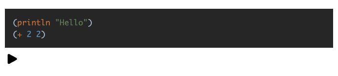
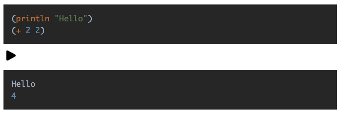

# React Interactive ClojureScript

Displays highlighted ClojureScript that can be run in the browser

Uses [react-syntax-highlighter](https://github.com/react-syntax-highlighter/react-syntax-highlighter) and [eval-cljs](https://github.com/thiagooak/eval-cljs)

```sh
npm i react-interactive-cljs
```

```js
"use client"
import { CljsCodeBlock } from "react-interactive-cljs"

<CljsCodeBlock>{`(println "Hello")
(+ 2 2)`}</CljsCodeBlock>
```

The code above will render like the image below


After clicking the "Run" button it will render like the image below
